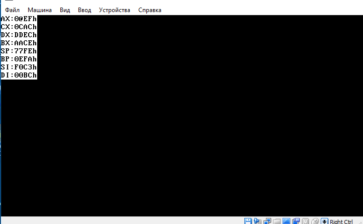

# SOMIPP Laboratory work #1 by Ganusceac Vlad

#### ***Notes***

There was a need in a Script which will make faster the routine of creating virtual floppy disks and their use in VM. My OS is Windows 10, so I have created MyScript.bat for the reasons above.


Secondly, the code of .asm files was successfully compiled of assembler compilator. Also I have checked that the *fasm* gives the same results.

## Task #1

*To write string in different ways i.e. using different interrupts.*

Each string should begin at a specific position.

### *Results for Task #1*


I have displayed one message using different methods.

First of all, it is possible to iterate string using loops or doing comparisons using different flags.

Secondly, in the _**int 10h**_ there are different possibilities to print the string:

* Printing each symbol apart;
* Printing the whole symbol.

There was a possibility to enable/disable blinking and to set color for each character in the string. I choosed the following way each string must look the same (lite grey color of each character).

Secondly, each string by default should start at a specific coordinate. The first string starts at (2, 10), the second one at (4, 10), ... , the n-th one starts at (2 * n, 10). To do this I used the following construction:

```javascript
    mov dh, 2
    mov dl, 10
    mov bh, 0
    mov ah, 2
    int 10h    
```
where:
 
 ``` dh ``` represents the row;
 
 ``` dl ``` represents the column;
 
 ``` bh ``` represents the page number (0..7).

 The position of the first string is setted. In order to define the position of another strings I should increment the ```dh``` value by to and to set ```dl``` value of 10.

Thirdly, the string should be define by the following way:

```javascript
jmp start

STR1 DB "Vlad has done this!", 0
strlength equ $ - STR1          

STR2 db "V", 007h, "l", 007h, "a", 007h, "d", 007h, " ", 007h, "h", 007h, "a", 007h, "s", 007h, " ", 007h, "d", 007h, "o", 007h, "n", 007h, "e", 007h, " ", 007h, "t", 007h, "h", 007h, "i", 007h, "s", 007h, "!", 007h

start:

```
The first string terminates with zero byte and in the _constant_ strlength is indicated it's length.

The second string is define character by character and for each character is indicated it's color. As I said before my aim was to print all the strings in one color.

The first way to print the string using ```int 10h / 0eh``` :

```javascript
    mov cx, strlength          ; int 10h 0eh
    mov di, 0
    mov ah, 0eh
   
Test1Case1:
    mov al, [STR1 + di]
    int 10h
    inc di
loop Test1Case1  
```

In this case I used the loop, because the string terminates with zero-byte and in that place the loop will be stopped. Also here I used direct mod of addres ```mov al, [STR1 + di]```.

Another way to implement printing this string with help of the same interrupt was the following:

```javascript
    mov ah, 0EH                ; int 10h 0eh 
    mov di, 0
Test1Case2:
    mov al, [STR1 + di]
    cmp al, 0
    JE Test1Case2end
    int 10h
    inc di
jmp Test1Case2
Test1Case2end:
```
Here I didn't use the loop. That's why I used Short Jump if first operand is Equal to second operand 
```javascript
    cmp al, 0
    JE Test1Case2end
```
In case if ```al``` is equal to zero I'll go out of the 'while loop'.

The ```STR1``` string was displayed not only by ```int 10h/0eh```, but also with help of other interrupts: 
[SOMMIP/displaying_strings.asm](https://github.com/VladGanuscheak/SOMIPP/blob/master/lab1/displaying_strings.asm)

The easiest way to print the string is the following:

```javascript
    add dh, 2                  ; int 10h 1302h
    mov dl, 10
    mov bp, offset STR2
    mov ax, 1302h
    int 10h
```
, but there is one huge weak point of printing strings in this way (each symbol in the string must have such an attribute as color). The color may be declared as binary or hexadecimal value (```b``` or ```h``` in the end of the value). For example, ```0Bh``` and ```1011b``` both represent the '```light cyan```' color.

## Task #2

To print ASCII table in form of table.

### *Results for Task #2*


First of all I should set the position of the cursor:

```javascript
    add dh, 2
    mov dl, 10
    mov bh, 0
    mov ah, 2
    int 10h 
```

To print all the characters of ASCII table I have used ```int 10h/0eh```.

Inside the loop (which has 256 iterations) is define ```InFormOfTable``` procedure, because I need to have some space between neighbour symbols in my table:

```call InFormOfTable``` - calling the respective procedure.

Code of this procedure:

```javascript
InFormOfTable:
    push ax
    mov al, 32
    int 10h
    int 10h
    int 10h
    pop ax
ret
```

Three times is printed symbol which has index ```32``` in ASCII table (space).

3 spaces between two ASCII symbols guaranties the form of table on the screen, because 80 (the width of the screen) divides without rest on 4.

All the code of this task: [ASCII_table](https://github.com/VladGanuscheak/SOMIPP/blob/master/lab1/ascii_code.asm)

## Task #3

To print the current state of all registers.

### *Results for Task #3*



To be clear the code I have define all the constants:

```javascript
    axRegister equ 0BAFh
    cxRegister equ 0CABh
    dxRegister equ 0FAECh
    bxRegister equ 0ABCEh
    bpRegister equ 0CEFAh
    siRegister equ 0FAC3h
    diRegister equ 0AFBCh

    newLine equ 0Dh, 0Ah

    zeroASCII equ "0"
    limitHexa equ 0Fh
    DecimalBS equ 10
```

All the functionality is doing the ```PrintRegistersProcedure```:

In this procedure I' m doing the manipulations with all the registers.
First of all, the result will be kept in the following string: 
```javascript
str_ShowRegisters db "AX:0000h", newLine, "CX:0000h", newLine, "DX:0000h", newLine, "BX:0000h", newLine, "SP:0000h", newLine, "BP:0000h", newLine, "SI:0000h", newLine, "DI:0000h"
str_ShowRegisters_end:
```
the ```str_ShowRegisters``` is the string which consists of all values of the registers. By the start all registers have value ```0000h``` and their values will be modified during execution of this procedure. It is important the order in which are written the registers, because in this order their are pushed in the stack (using   ```pusha```).

the ```str_ShowRegisters_end``` determines the end of the string and it is used to determine the length of the string (other way was to create zero-byte terminated string).

The ```PrintRegistersProcedure``` is devided into some logical parts: 
[SOMIPP/print_registers.asm](https://github.com/VladGanuscheak/SOMIPP/blob/master/lab1/print_registers.asm)

The stack has property to give the last element when we pop it, so to set all the register properly we should mention that the ```bx``` in our case starts at ```DI:000h```. The following solution fixes this problem: use of the ```WriteInTheRegisterProcedure``` functionality and after subtracting 10 from ```bx```.
